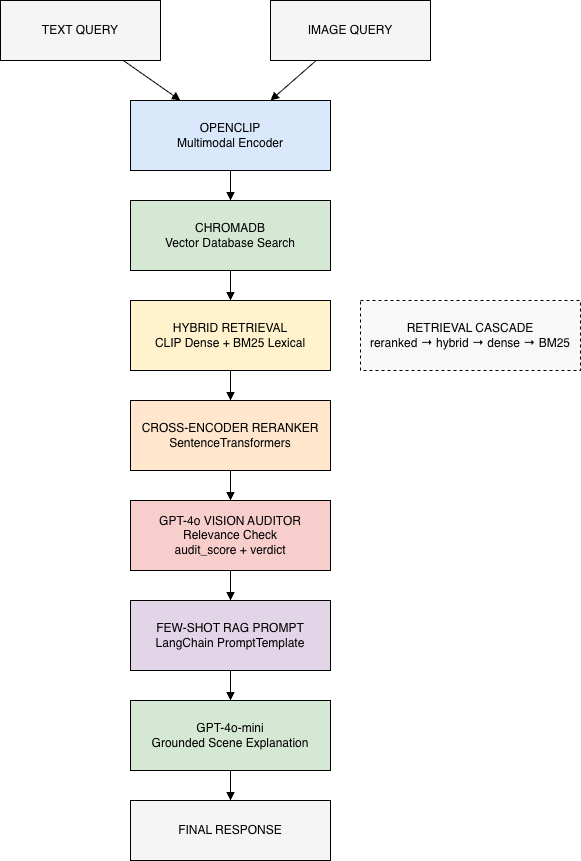

# Multimodal Retrieval and Ranking System with LLM Verification

A multimodal retrieval and reasoning system supporting **text→image, image→image, and image→caption search** using vision-language embeddings and large language models. Images and captions from the **COCO 2017 dataset** are encoded using **OpenCLIP (ViT-L-14)** and indexed in a **ChromaDB vector database** for persistent similarity search.

The system combines **dense CLIP retrieval, BM25 lexical retrieval, SentenceTransformers cross-encoder reranking, GPT-4o-mini vision-based verification, and few-shot RAG prompting** to improve retrieval robustness and generate grounded scene explanations from retrieved evidence.

---

## Key Features

- **Multimodal Embedding Space:** Uses **OpenCLIP (ViT-L-14)** to encode images and captions from the **COCO 2017 dataset** into a shared embedding space. Embeddings are cached as numpy arrays on disk for efficient startup.
- **Vector Database Search:** Indexes image embeddings in **ChromaDB** for persistent multimodal similarity search across sessions.
- **Multi-Stage Retrieval Pipeline:** Combines **dense CLIP vector retrieval, BM25 lexical retrieval, and SentenceTransformers cross-encoder reranking** with hybrid score fusion (0.7 dense + 0.3 BM25) to improve retrieval quality.
- **Fallback Retrieval Workflow:** Implements a production-style retrieval cascade — `reranked → hybrid` — with exception handling to ensure results are returned under degraded conditions.
- **Vision-Based Verification:** Retrieved images are passed to **GPT-4o-mini Vision**, which assigns an `audit_score` (0–10) and `audit_verdict` (match / weak_match / reject). Final ranking uses a blended score of `0.7 × rerank_score + 0.3 × audit_score`. Rejected results are filtered before display.
- **Few-Shot Grounded RAG:** Uses a **LangChain PromptTemplate with few-shot examples** to generate scene explanations using retrieved captions as grounded evidence.
- **Evaluation Framework:** Automated evaluation over 300 COCO 2017 queries computing **Recall@K, Precision@K, MRR, nDCG@K, and median latency** across all pipeline stages.
- **Interactive Chainlit Demo:** Deployed as a standalone Chainlit application with artifact-based serving — loads pre-exported embeddings and metadata from disk and returns ranked, audited results with captions, scores, and audit verdicts interactively.

---
## Architecture

---

## Demo
<a href="{{ '/images/test.mp4' | relative_url }}" target="_blank"
     style="text-decoration:none; font-size:18px;">
    ▶️ Watch Demo
  </a>

---
## Results

| Stage | Recall@1 | Recall@5 | MRR | nDCG@5 |
|---|---|---|---|---|
| Plain dense | 0.37 | 0.65 | 0.47 | 0.52 |
| Cached / ChromaDB | 0.36 | 0.64 | 0.47 | 0.51 |
| Hybrid (CLIP + BM25) | 0.80 | 0.92 | 0.85 | 0.86 |
| Hybrid + reranked | **0.96** | **0.98** | **0.97** | **0.97** |

Hybrid reranking achieves **~2.6× improvement in Recall@1** over the plain
